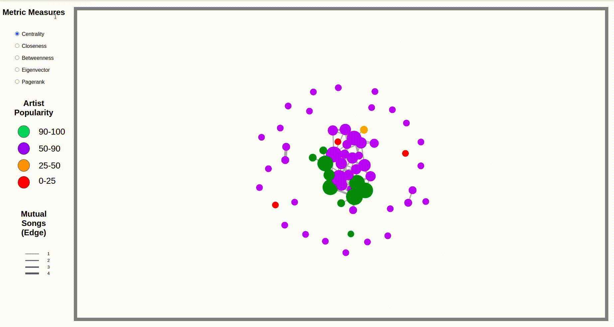

# Análisis y visualización de redes

El objetivo de esta práctica es llevar a cabo el proceso completo de análisis de una red social a través de la obtención, procesamiento y visualización de un conjunto de datos de la red.

## Adquisición de datos

En este apartado se detalla el proceso a seguir para generar el fichero json correspondiente qu ese utilizará para alimentar a netwrokX y generar las métricas de grafos correspondientes que serán utilizadas en el grafo final.

Previamente debemos tener una cuenta en Sopity API y crear un fichero ```credentials.json```  situado en la carpeta etl. EL fichero tiene el siguiente formato:

```
{
  "CLIENT_ID" : "fake_client_id",
  "CLIENT_SECRET" : "fake_client_secret"
}
```

Una vez que tengamos el fichero creado, basratá con ejecutar el siguiente script de python situado en la carpeta etl:

```
python preprocess_data.py
```

Este fichero obtiene información para cada uno de los artistas situados en el fichero artists de la carpeta data.
Tras la ejecución del script se creará un fichero en formato json denominado ```processed_data.json``` 

## Proceso

En este apartado se detalla los pasos a seguir para generar el fichero json final que se utilizará para alimentar al grafo creado con D3js. Para ello debemos ejecutar 
el script de python situado en la carpeta etl denominado ```graphs.py```

```
python graphs.py
```

Este script además de añadir las métricas de grafos vistas en la asignatura a los artistas, tambien crea en la carpeta etl/images un grafo con networkX, que como se apreciará en la visualización final con D3js es parecido.

## Visualización 

En este apartado se detalla que elementos continen el grafo finl desarrollado con D3js.

- **Colores de los nodos:** Representan diferentes clases en función de la popularidad del artista:

    - **Artistas con popularidad muy alta (Color Verde) :** Contiene los artistas con una popularidad situada entre los 90 y 100 ptos.
    - **Artistas con popularidad alta (Color Morado) :** Contiene los artistas con una popularidad situada entre los 50 y 90 ptos.
    - **Artistas con popularidad muy alta (Color Naranja) :** Contiene los artistas con una popularidad situada entre los 25 y 50 ptos.
    - **Artistas con popularidad muy alta (Color Rojo) :** Contiene los artistas con una popularidad situada entre los 0 y 25 ptos.
    
- **Grosor de las aristas:** Representan el número de canciones en las que dos artistas han participado ellos dos juntos. 

- **Cuadro de mandos de métricas** Nos permite seleccionar la métrica a usar. En función de esta métrica aumentará el tamaño del nodo de la misma. Estan disponibles las siguientes métricas:
    
    - Centrality
    - Closeness
    - Betweenness
    - Eigenvector
    - Pagerank
    
Se han añadido tool tips tanto a las aristas como a los nodos para poder conocer toda la información de los artistas y como se relacionan entre ellos.

A continuación se muestra un gif del comportamiento del grafo:



